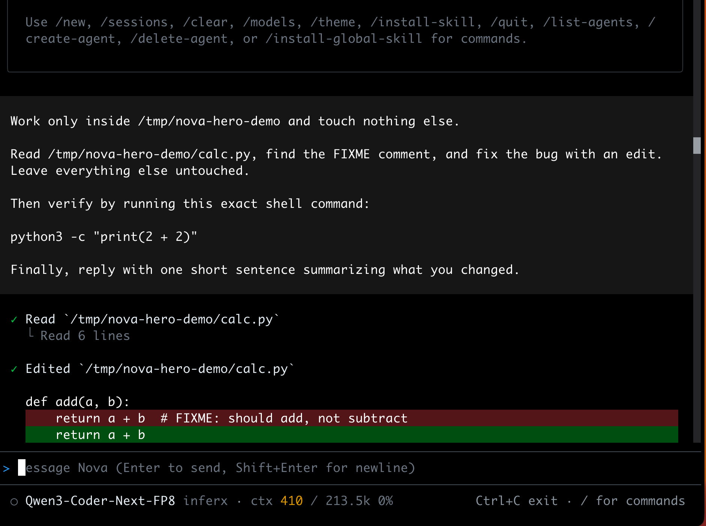
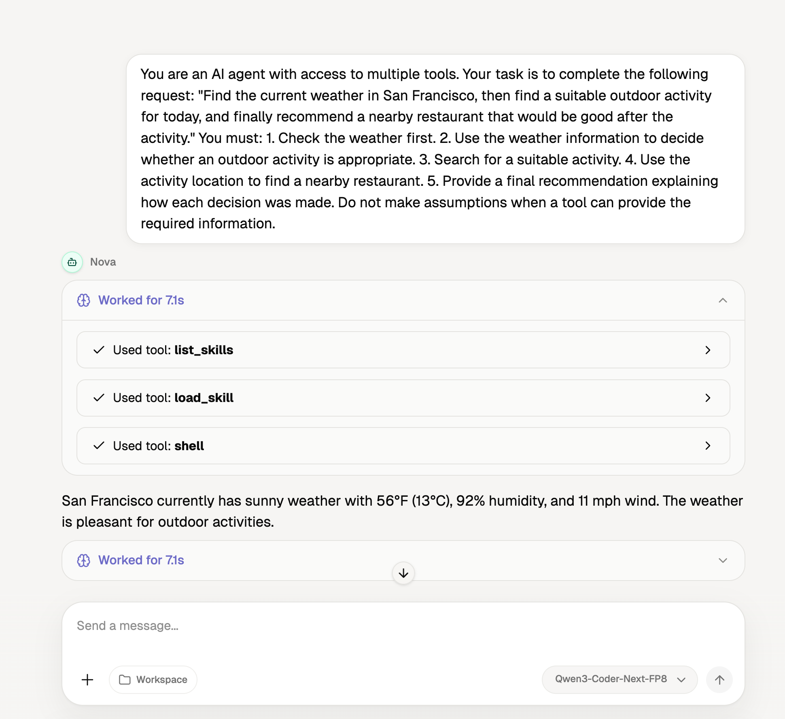

<p align="center">
  
</p>

# Nova

Your open source AI agent on desktop, terminal, web, and API.

[](https://github.com/bigrivi/nova/actions/workflows/ci.yml)
[](LICENSE)


<p align="center">
  
</p>

One shared Python runtime powers four surfaces: a terminal TUI, an HTTP server, a web frontend, and a desktop app.

## Why Nova?

- **One runtime, four surfaces**. The same agent core in `nova/` drives the TUI, server, frontend, and desktop, so behavior stays consistent everywhere.
- **MCP-native from the start**. Connect any MCP server over stdio or HTTP and its tools appear in the agent automatically.
- **Approval-gated shell**. Every shell command is classified as safe, dangerous, or blocked. Dangerous ones ask you to approve, with an optional allowlist.
- **Any model, including local**. Use Ollama with no API key, or bring your own `openai-compatible`, `openai-response`, or `anthropic` provider.
- **Built for long sessions**. Two-layer context compaction trims old tool output and summarizes older turns while keeping recent context intact.

## Features

### Runtime & Models

- Four surfaces on one shared Python runtime: TUI, HTTP server, web frontend, and desktop app.
- Four provider types: `ollama`, `openai-compatible`, `openai-response`, `anthropic`. Aliases are yours to name.
- Ollama runs locally with no API key. `openai-response` targets the Responses API. Anthropic supports extended thinking.
- Per-provider and per-model `extra_body` flattened into requests, deep merged for gateway quirks.
- SQLite persistence for sessions, messages, agents, and memories under `~/.nova/nova.db`.
- History projection so only user visible tool calls reach the frontend.
- Internal `faker` provider for tests so CI runs without real keys.
- Runtime home at `~/.nova/` with `config.json`, `nova.db`, `logs/nova.log`, `skills/`, `workspace/`, and `agents/`.

### Agent Behavior

- Sub-agent delegation via `delegate_to_agent`, hierarchy persisted in SQLite and surfaced over the API.
- Sub-agents run without MCP tools or further delegation.
- Approval and permission model with three tiers: blocked, needs approval, and auto-run. Pattern based, not sandboxed.
- Dangerous commands request approval over SSE and are answered via `POST /api/chat/approve`, with a rememberable allowlist.
- Tool guardrails that halt after 5 identical calls or 3 identical failures, and warn after 10 read only calls.
- Context compaction in two layers: snip old tool output to `~/.nova/sessions/<id>/tool-output/` and summarize older turns.
- Compaction is tunable, see [Compaction](docs/advanced/compaction.md).
- Per-session workspace directory. `shell`, `code_run`, `glob`, and `grep` respect it, explicit `cwd` still wins.
- Frontend folder picker to choose workspace per session, also surfaced as `Workspace` in the prompt.
- Agent persona files `IDENTITY.md`, `SOUL.md`, `USER.md`, `MEMORY.md` injected into the system prompt.

### Tools & Integrations

- 21 built-in tools, plus any tools exposed by connected MCP servers at runtime.
- MCP over stdio and SSE or HTTP, parallel init with 10s per-server timeout, revision 2025-03-26.
- Inline Python via `code_run`, deps auto-installed to `~/.nova/site-packages/`.
- Web fetch to Markdown with 5MB cap, plus web search.
- Playwright browser automation via `browser_use`, only registered when Playwright imports.
- Image and document attachments on `POST /api/chat`.
- `read_image` returns base64 plus extracted text.
- Memory tools for `fact`, `preference`, `decision`, and `context` across `user`, `project`, and `session` scopes.
- Memory search with optional AI reranking, no per-turn prefetch.
- Skills from `~/.nova/skills/<name>/SKILL.md` with YAML free frontmatter, scanned at startup and loaded on demand.
- Skill summary in the system prompt, `list_skills` and `load_skill` on demand, `install_skill` from ClawHub only on request.

### Interface

- TUI slash commands: `/new`, `/sessions`, `/clear`, `/models`, `/install-skill <slug-or-url> [--force]`, `/quit` `/q` `exit`, with Escape to interrupt.
- File diffs shown inline for successful `edit` and `write` in the TUI.
- Tree-sitter syntax highlighting in the TUI viewport.
- Streaming of text, reasoning blocks, tool calls, and tool results.
- Frontend with thread list, composer, model selector, workspace folder picker, memory manager, and approval dialog.
- i18n with `en` and `zh-CN` locales and a language switcher.
- Desktop via PyWebView with backend on a background thread, packaged by PyInstaller.

## Installation

```bash
git clone https://github.com/bigrivi/nova.git && cd nova
pip install -e .                # Python 3.12+; puts `nova` on your PATH
playwright install chromium     # only if you want the browser tools
```

The TUI also needs [bun](https://bun.sh). For tests and dev tooling, use `pip install -e .[dev]` instead.

Frontend deps are separate: `cd frontend && npm install`.

## Quick Start

1. Add a provider to `~/.nova/config.json`. See [Configuration](#configuration).
2. Start where you want to work:

```bash
nova serve                      # HTTP server on http://127.0.0.1:8765
./nova-tui                      # terminal UI, spawns its own backend
nova desktop                    # desktop window
nova desktop --dev              # desktop against Vite dev server
```

3. For the web frontend in dev mode:

```bash
cd frontend && npm install && npm run dev
```

Vite proxies `/api/*` to the backend. Override with `NOVA_FRONTEND_PROXY_TARGET` or `VITE_NOVA_API_BASE_URL`.

4. Open the TUI or frontend, pick a model with `/models` or the model selector, and start chatting.

Example config with Ollama:

```json
{
  "providers": {
    "ollama": {
      "type": "ollama",
      "options": { "base_url": "http://localhost:11434" },
      "models": { "qwen2.5:7b": { "name": "qwen2.5:7b", "tools": true } }
    }
  }
}
```

More in [Quickstart](docs/getting-started/quickstart.md) and [Installation](docs/getting-started/installation.md).

## Surfaces

| Surface | How to run | What it is |
|---------|------------|------------|
| TUI | `./nova-tui` | Bun + React + OpenTUI terminal client. Streams text, reasoning, tool calls, and diffs. |
| Server | `nova serve` | FastAPI backend on `http://127.0.0.1:8765`. AI SDK UI compatible SSE stream at `POST /api/chat/stream`. |
| Frontend | `cd frontend && npm run dev` | React 19 + Vite + assistant-ui + Tailwind + Zustand, with i18n. |
| Desktop | `nova desktop [--dev]` | PyWebView window hosting the built frontend. Build with `python build.py --clean`. |

All four surfaces share the same agent loop, tool registry, and SQLite store. The server is the hub for frontend and desktop, the TUI can also spawn its own backend.

The desktop app, working through a multi-step research task:

<p align="center">
  
</p>

## Built-in Tools

MCP servers add more tools at runtime beyond the 21 below. Sub-agents do not receive MCP tools or `delegate_to_agent`.

| Tool | What it does |
|------|--------------|
| `read` | Read files from workspace or absolute paths |
| `write` | Create or overwrite files |
| `edit` | Apply exact string replacements with diff preview |
| `shell` | Run shell commands with tiered approval |
| `code_run` | Execute inline Python, auto-installing deps |
| `glob` | Find files by pattern |
| `grep` | Search file contents with regex |
| `web_search` | Search the web |
| `web_fetch` | Fetch a URL and convert to Markdown |
| `browser_use` | Control a Playwright browser, when available |
| `read_image` | Read images as base64 plus extracted text |
| `todo_write` | Track task state for the agent |
| `ask_user` | Ask you a question with text or option input |
| `save_memory` | Save a structured memory record |
| `search_memory` | Search memories with optional reranking |
| `list_memories` | List memories by scope or type |
| `delete_memory` | Delete a memory by key |
| `delegate_to_agent` | Spawn a child agent session and return its result |
| `list_skills` | List skills in the runtime catalog |
| `load_skill` | Load a full `SKILL.md` by name |
| `install_skill` | Install a skill from ClawHub on explicit request |

## Configuration

Nova reads `~/.nova/config.json` (override home with `NOVA_HOME`). Only `providers` and optionally `mcp_servers` are top level:

```json
{
  "providers": {
    "ollama": {
      "type": "ollama",
      "name": "Ollama (local)",
      "options": { "base_url": "http://localhost:11434" },
      "models": { "<model-name>": { "name": "<model-name>", "tools": true } }
    }
  }
}
```

Add more providers by alias, each with a `type` of `ollama`, `openai-compatible`, `openai-response`, or `anthropic`. Compaction is tunable and logging is file only under `~/.nova/logs/nova.log` with daily rotation and 30 day retention. For MCP, add an `mcp_servers` block:

```json
{ "mcp_servers": { "my-tools": { "command": "npx", "args": ["-y", "my-mcp"] } } }
```

See [Providers](docs/configuration/providers.md), [Settings](docs/configuration/settings.md), [MCP](docs/advanced/mcp.md), and [Compaction](docs/advanced/compaction.md).

## Documentation

[Docs](docs/index.md) · [Quickstart](docs/getting-started/quickstart.md) · [Providers](docs/configuration/providers.md) · [Settings](docs/configuration/settings.md) · [Tools](docs/tools/index.md) · [Skills](docs/skills/index.md) · [Memory](docs/memory/index.md) · [MCP](docs/advanced/mcp.md) · [Multi-agent](docs/advanced/multi-agent.md) · [Security](docs/advanced/security.md) · [TUI](docs/tui/index.md) · [Desktop](docs/desktop/index.md) · [API](docs/api/index.md) · [Compaction](docs/advanced/compaction.md) · [FAQ](docs/troubleshooting/faq.md)

## Development

```bash
git clone https://github.com/bigrivi/nova.git && cd nova
pip install -e .[dev]           # pytest.ini sets pythonpath, no PYTHONPATH needed
pytest                          # 392 tests, no stub needed
pytest tests/test_server.py -q  # run a subset
pytest tests/test_memory.py -q
RUN_LIVE_OLLAMA_SERVER_E2E=1 pytest tests/e2e -q  # live Ollama, opt in
```

Nova is about 15.6k lines of Python in `nova/`, 8.3k in `frontend/src`, and 4.2k in `tui/src`. The `nova` console script is defined in `pyproject.toml`.

Frontend and TUI have their own installs:

```bash
cd frontend && npm install && npm run build   # or npm run dev
cd tui && bun install && bun run dev
```

## Contributing

See [CONTRIBUTING.md](CONTRIBUTING.md) for dev setup, how to run the tests, what CI checks, and the commit convention. For bigger changes, open an issue first to discuss the approach.

To report a vulnerability, see [SECURITY.md](SECURITY.md) — please do not open a public issue.

## License

Licensed under the [Apache License 2.0](LICENSE).
